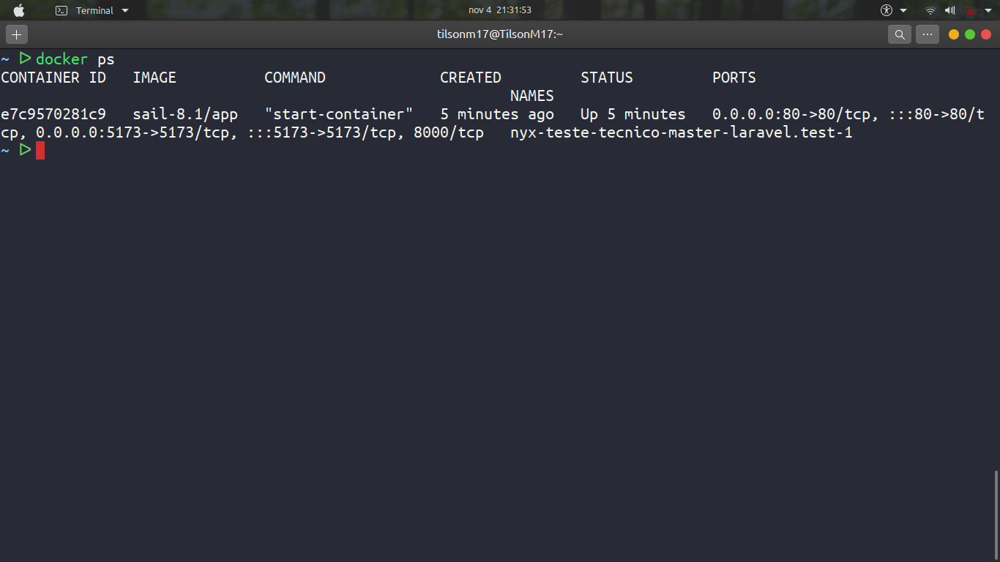
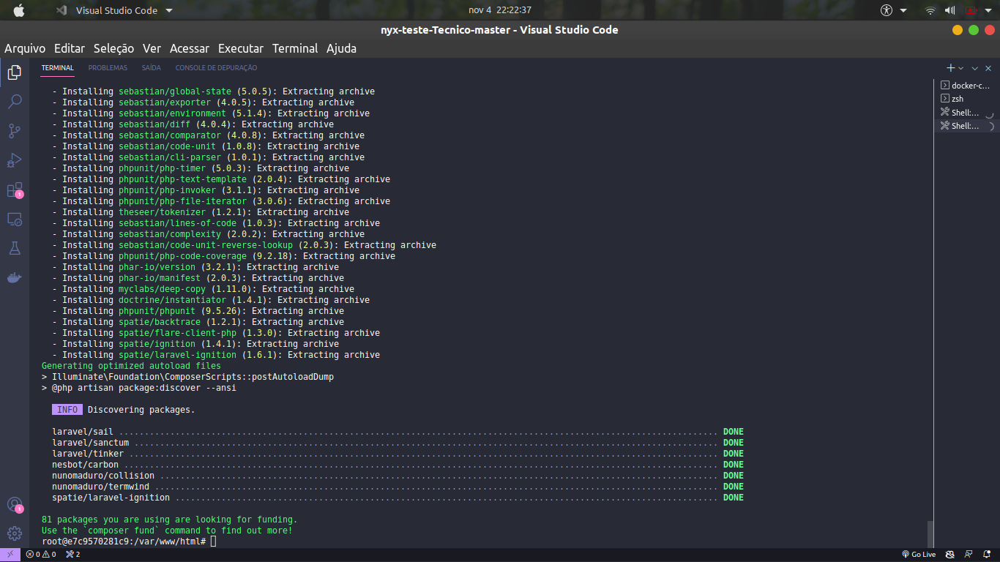

## Teste Tecnico

Esta aplicação foi concebida usando o framework de PHP [Laravel](https://laravel.com/). Ela usa o pacote Laravel Sail que ajuda muito na gestão dos Containers Docker. Estamos a usar o Banco de dados PostgreSql.
A aplicação tem 3 Containers:
    
- `Sail-8.1/app`
- `postgres:14`
- `Redis`

---

 - ### [Como rodar](#como-rodar-o-projecto)

 ## Como rodar o projecto

Para rodar o Projecto voçe precisa de ter o Docker instalado na sua maquina.

Abra o seu terminal e faça um clone do projecto:

    $ git clone https://github.com/TilsonM17/nyx-teste-Tecnico.git

Depois, entre na pasta do projecto e execute o container do docker.

    $ cd nyx-teste-Tecnico
    ~/nyx-teste-Tecnico/ $  docker-compose -f docker-compose.yml up 

Agora verifique se os containers levantaram:
    
    $ docker ps

Se a resposta for similar a esta que esta na imagem, podemos avançar para o proximo passo.

Na imagem mostra que o nosso container esta a rodar, copie o CONTAINER ID, vamos entrar dentro do container `sail-8.1/app`, depois instale as dependencias do projecto e execute o seguinte.

    $ docker exec -it [Conatiner_ID] bash 

    // De permissão a pasta storage
    $ chmod -R 777 storage

    //Instalar as dependencias
    $ composer install

    Copiar o arquivo .env
    $ cp .env.example .env

     //Gerar a chave da aplicação
    $ php artisan key:generate

    // Parar todos containers
    $ docker stop $(docker ps -a -q)

    //Executar os containers
    $ ./vendor/bin/sail up 

Agora uma coisa importante é rodar as migrações.

    //Entrar no modo Root
    $ ./vendor/bin/sail root-shell

    //Rodar as migrate
    $ php artisan migrate

No arquivo .env.example ja vem com o valor de `MOVIE_KEY` definido, esta variavel contem a chave da api que estamos a usar,deixei o valor da chave no .env.example para maior agilidade.

Mas, esteja avontade para definir o seu valor

    MOVIE_KEY='seu valor'

Pode acessar o [localhost](http://localhost).

 ## Rodar os Testes

 Entre no modo root e execute os testes.

    $ ./vendor/bin/sail root-shell

    //Rodar os testes
    $  php artisan test

**NOTA:** Se por algum motivo ao executar o comando acima de testes e ele retornar o erro  `Test directory "/var/www/html/./tests/Unit" not found`, crie uma pasta Unit dentro do directorio `tests`